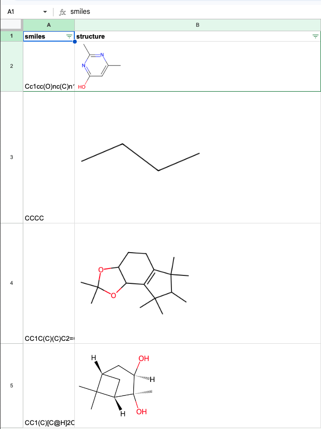

# Vexo

Make BigQuery and Google Sheets Chemistry Native

## Installation

Running `intall.sh` at the top directory will create cloud functions for all of the cheminformatic functions.  The caller
of the script must have access to create assign roles, create cloud functions, and create BigQuery datasets.  The default
project configured to the `gcloud` cli will be used to create the cloud and bigquery functions.

Currently the cloud functions targetting Google Sheets are not authenticated.  If you wish to authenticate them you will manually have to modify the `install.sh` script removing `--allow-unauthenticated` and adding a service account IAM binding like is done for the BigQuery functions.

## BigQuery

The `install.sh` script will create a dataset in BigQuery names `vexo`.  When it is complete there should be a function that matches each seen in `biquery_functions.csv`.

### Examples

#### Canonical Smiles

Canononicalize smiles based on standard rdkit canonicalization.

```
SELECT vexo.canonical_smiles("C1=CC=CC=C1")
```

#### Iso-Canonical Smiles

Same as above but keep stereochemistry in the returned smiles.

```
SELECT vexo.iso_canonical_smiles("CC1(C)[C@@H]2C[C@@H](O)[C@@](C)(O)[C@H]1C2")
```

### Substructure Search

Search for substructure match.  The first argument is the pattern and the second the smiles.  The pattern
can also be a SMARTS pattern.

```
SELECT vexo.substructure_match("c1ccccc1", "CCO/C=N/c1ccccc1")
```

## Sheets

The `install.sh` also installs a set of functions that are targetting more general HTML requests that also work directly in Google Sheets.  This can be very
valuable if you are a Chemist that is comfortable with Sheets but not with coding.  It opens up most functionality available in rdkit to being called
directly from a Sheet.

The deployed Cloud Function has this pattern: `https://<REGION>-<PROJECT>.cloudfunctions.net/vexo-<FUNCTION>`. Where:
1. <REGION> is the GCP region configured in your CLI.
2. <PROJECT> is the GCP project configured in your CLI.
3. <FUNCTION> is the vexo function installed from this repo.

### Examples

In the below examples we will use `us-east1` as the region and a placeholder project of `vexo`.


#### Structure PNG

This first example draws the structure of a molecule from the SMILES in a sheet.  The function has this pattern:

```
=IMAGE(CONCAT("https://us-east1-vexo.cloudfunctions.net/vexo-smiles-png/", ENCODEURL(A2)), 1)
```

where A2 is the cell that contains the smiles.

Below is an example PNG of what you should expect:




